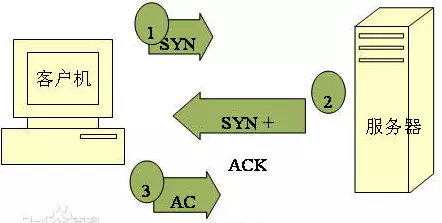

### TCP协议
TCP： Transmission Control Protocol，传输控制协议，是一种面向连接的、可靠的、基于字节流的传输层通讯协议。
TCP是服务于网络通讯的一种协议，建立一次通讯协议需要经过三次握手。
> 1. 客户端发送syn包到服务器，并进入SYN_SEND状态，等待服务器确认。
> 2. 服务器收到syn包，必须确认客户端的SYN，同时自己也发送一个SYN包，即SYN+ACK包，此时服务器进入SYN_RECV状态。
> 3. 客户端收到服务器的SYN+ACK包，向服务器发送确认包ACK，这个包发送完毕后，客户端和服务器进入ESTABLISHED状态，完成三次握手。

> SYN：synchronous 建立联机
> ACK：acknowledgement 确认
> SYN_SENT：请求连接
> SYN_RECV：服务端被动打开后，接收到了客户端的SYN并且发送了ACK时的状态。再进一步接收到客户端的ACK就进入ESTABLISHED状态。
### UDP协议
UDP： User Datagram Protocol，用户数据包协议
相比于TCP的面向连接需要反复确认的繁琐步骤，UDP是一种性格独立独行	并且主观性超强的非面向连接的协议，使用UDP协议经常通信并不需要建立连接，它只是负责把数据尽可能快的发送出去，简单粗暴但不可靠，而在接收端，UDP把每个消息段放入队列中，接收端程序从队列中读取数据。使用场景如QQ语音、QQ视频
### 套接字socket
socket：也叫套接字，是一组实现TCP/UDP通信的接口api，也就是说无论TCP还是UDP。通过对socket的编程，都可以实现TCP/UDP通信，作为一个通信链的句柄，它包含网络通信必备的5种信息：
> 1. 连接使用的协议
> 2. 本地主机的IP地址
> 3. 本地进程的协议端口
> 4. 远地主机的IP地址
> 5. 远地进程的协议端口

可见，socket包含了通信本方和对方的ip和端口以及连接使用的协议。通信双方中的一方（客户端）通过socket对另一方（服务端）发起连接请求，服务端在网络上监听请求，当收到客户端发送来的请求时，根据socket里携带的信息，定位到客户端，就相应请求，把socket描述发给客户端，双方确认之后连接就建立了。
因此套接字之间的连接过程有三个步骤：
> 1. 服务器监听：服务器实时监控网络状态等待客户端发来的连接请求。
> 2. 客户端请求：客户端根据远程主机服务器的IP地址和协议端口向其发起连接请求。
> 3. 连接确认：服务端收到套接字的连接请求之后，就响应请求，把服务端套接字描述发给客户端，客户端收到后一旦确认，则双方建立连接，进行数据交互。

通常情况下socket连接就是TCP连接，因此socket连接一旦建立，通讯双方就开始互发数据进行通信，知道双方中的一方或双方断开连接为止。
socket在即时通讯（qq等各种聊天软件）等应用上应用广泛。
### HTTP协议
HTTP协议：Hypertext Transfer Protocol，也叫超文本传输协议，它是一种基于TCP/IP协议栈、在表示层和应用层上的协议（TCP在传输层的协议），也就是：
> * TCP/IP是位于传输层上的一种协议，用于在网络中传输数据；
> * HTTP协议是应用层协议，基于TCP协议，用于包装数据，程序使用它进行通信，可以简单高效的处理通信中数据的传输和识别处理；

上面说到socket连接一旦建立就保持连接状态，而HTTP连接则不一样，它基于TCP协议的短连接，也就是客户端发起请求，服务端相应请求之后，连接就会自动断开，不会一直保持。
### URL
URL：Uniform Resource Locator 统一资源定位符。说白了就是网络上用来标识具体资源的一个地址，包含了用户查找该资源的信息，HTTP使用它来传输数据和建立连接
一个URL有以下组成部分：
> 1. 协议
> 2. 服务器地址（域名或IP+端口）
> 3. 路径
> 4. 文件名

### DNS
DNS：Domain Name Server，域名服务器。
是进行域名（domain name）和与之相对应的IP地址（IP address）转换的服务器。
DNS保存了一张域名（domain name）和与之相对应的IP地址（IP address）的表，以解析消息的域名。
因此，当用户在浏览器输入https://www.baidu.com回车时，它经历了以下步骤：
> 1. 浏览器根据地址去本身缓存中查找dns解析记录，如果有，则直接返回ip地址，否则浏览器会查找操作系统中（hosts文件）是否有该域名的dns解析记录，如果有则返回。
> 2. 如果浏览器缓存和操作系统hosts中均无该域名的dns解析记录，或者已经过期，此时就会向域名服务器发起请求来解析这个域名。
> 3. 请求会先到LDNS（本地域名服务器），让它来尝试解析这个域名，如果LDNS也解析不了，则直接到根域名解析器请求解析。
> 4. 根域名服务器给LDNS返回一个所查询的主域名服务器（gtLDServer）地址。
> 5. 此时LDNS再向上一步返回的gTLD服务器发起解析请求。
> 6. gTLD服务器接收到解析请求后查找并返回此域名对应的Name Server域名服务器的地址，这个Name Server通常就是你注册的域名服务器（比如阿里dns、腾讯dns等）。
> 7. Name Server域名服务器会查询存储的域名和IP的映射关系表，正常情况下都根据域名得到目标IP记录，连同一个TTL值返回给DNS Server域名服务器
> 8. 返回该域名对应的IP和TTL值，Local DNS Server会缓存这个域名和IP的对应关系，缓存的时间有TTL值控制
> 9. 把解析的结果返回给用户，用户根据TTL值缓存在本地系统缓存中，域名解析过程结束。
